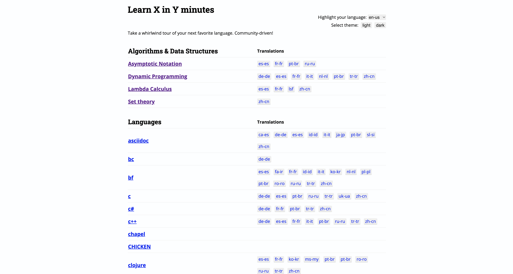

# Learn X in Y Minutes

This README describes how to use different languages styles. It is guided by the website [Learn X in Y](https://learnxinyminutes.com/)

## About This Project
They are projects that I have been using as I learn.
___

## Languages
These are the languages I will be learning.

- [x] Markdown  
- [ ] JavaScript
- [ ] HTML
- [ ] CSS
- [ ] Linux
